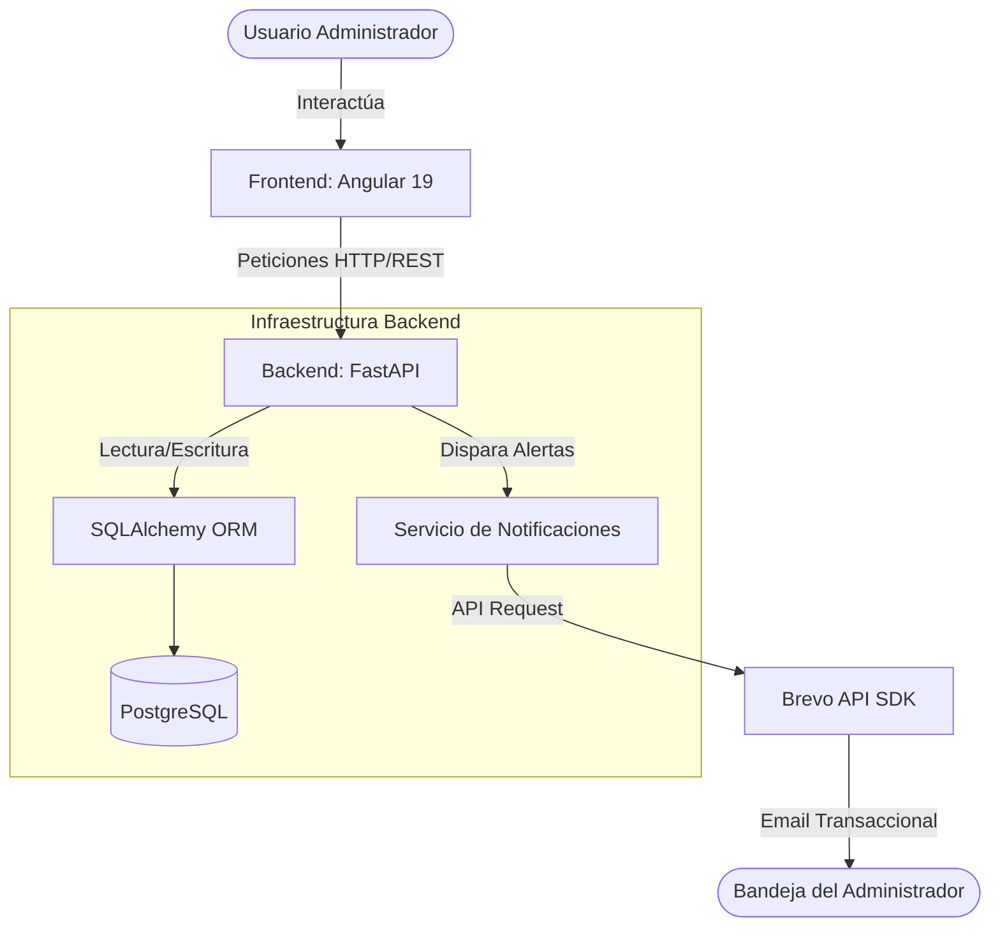

# StockFlow - Sistema de Gestión de Inventario

Sistema integral de gestión de inventario, diseñado con una arquitectura cliente-servidor para optimizar el control de stock, movimientos de productos y emisión de alertas tempranas.

## Descripción General

StockFlow permite a los administradores mantener un control riguroso sobre su catálogo de productos. El sistema cuenta con autenticación segura, control de roles (Administrador/Usuario), registro histórico de movimientos y un módulo automatizado de notificaciones que alerta vía correo electrónico cuando un producto alcanza un nivel de stock crítico.

## Arquitectura del Sistema

El proyecto está estructurado como un monorepo, separando claramente las responsabilidades del cliente y del servidor.



## Stack Tecnológico

La solución fue construida utilizando las siguientes herramientas:

| Componente | Tecnología Core | Herramientas Adicionales / Librerías |
| :--- | :--- | :--- |
| **Frontend** | Angular 19 | Tailwind CSS, Signals, RxJS, Animaciones CSS Nativas |
| **Backend** | Python 3.11+ / FastAPI | Pydantic, Passlib (Bcrypt), PyJWT, SlowAPI |
| **Base de Datos** | PostgreSQL | SQLAlchemy 2.0, Alembic (Migraciones) |
| **Servicios 3ros** | Brevo SDK | Envío de correos electrónicos transaccionales |
| **Herramientas** | uv | Gestión de paquetes y entornos virtuales en Python |

## Estructura del Repositorio

```text
sistema-gestion-de-inventario/
├── backend/                # Lógica de negocio, API REST y base de datos
│   ├── alembic/            # Historial de migraciones de base de datos
│   ├── app/                # Código fuente de FastAPI (rutas, modelos, servicios)
│   ├── static/             # Recursos estáticos (imágenes, logos para correos)
│   └── pyproject.toml      # Configuración de dependencias (uv)
│
├── frontend/               # Aplicación cliente (SPA)
│   ├── src/                # Código fuente de Angular (componentes, servicios, guards)
│   ├── public/             # Assets y configuraciones públicas
│   └── angular.json        # Configuración del workspace de Angular
│
└── README.md               # Documentación principal del proyecto
```

## Requisitos Previos

Para ejecutar este proyecto en un entorno de desarrollo local, es necesario contar con:

* **Node.js** (v18 o superior) y **Angular CLI**.
* **Python** (v3.11 o superior).
* **uv** instalado para la gestión de dependencias del backend.
* **PostgreSQL** ejecutándose localmente o en un contenedor Docker.
* Cuenta en **Brevo** para la obtención de la API Key (necesaria para el módulo de alertas).

## Instalación y Configuración

El proyecto requiere levantar ambos entornos por separado.

### 1. Configuración del Backend

Dirígete a la carpeta `/backend` e instala las dependencias utilizando `uv`:

```bash
cd backend
uv venv
source .venv/bin/activate  # En Windows: .venv\Scripts\activate
uv sync
```

Asegúrate de configurar tu archivo `.env` con las variables de conexión a la base de datos y la API Key de Brevo (`BREVO_API_KEY`, `SENDER_NAME`, etc.). Luego, ejecuta las migraciones y levanta el servidor:

```bash
alembic upgrade head
uv run uvicorn app.main:app --reload
```

### 2. Configuración del Frontend

En una nueva terminal, dirígete a la carpeta `/frontend`, instala los módulos de Node y levanta el servidor de desarrollo:

```bash
cd frontend
npm install
ng serve
```

La aplicación estará disponible de forma predeterminada en `http://localhost:4200`.
